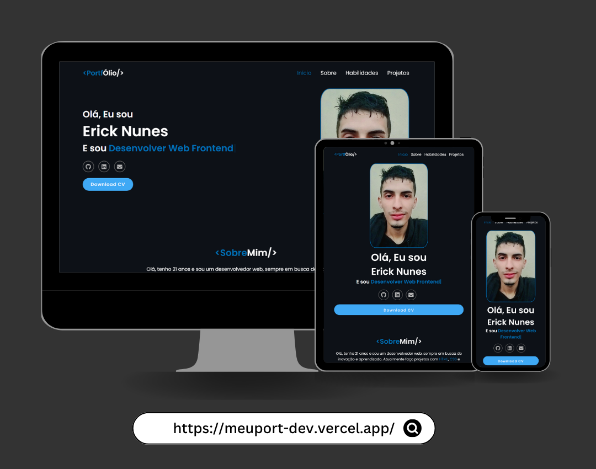

<h1 align="center">Portfólio</h1>

Esse repositório contém os arquivos e códigos fontes do meu site pessoal.

	<a href="#-tecnologias-usadas">Tecnologias</a>&nbsp;&nbsp;&nbsp;|&nbsp;&nbsp;&nbsp;
	<a href="#-funcionalidades">Funcionalidades</a>&nbsp;&nbsp;&nbsp;|&nbsp;&nbsp;&nbsp;
	<a href="#-deploy">Deploy</a>&nbsp;&nbsp;&nbsp;|&nbsp;&nbsp;&nbsp;
	<a href="#-licença">Licença</a>

    

## 🔧 Tecnologias Usadas

- React.js
- HTML
- CSS
- Javascript
- React Scroll

## 💡 Funcionalidades

- Layout responsivo, otimizado para dispositivos móveis
- Navegação fluida por seções com scroll suave
- Download de currículo disponível diretamente na interface
- Links diretos para redes e contatos profissionais
- Cards e modais dinâmicos que exibem projetos realizados

## 🚀 Deploy

O projeto foi hospedado no Vercel. [VER PROJETO](https://meuport-dev.vercel.app)

## 📄 Licença

Este projeto é licenciado sob os termos de licença MIT - veja o arquivo [LICENSE](LICENSE) para mais detalhes.
